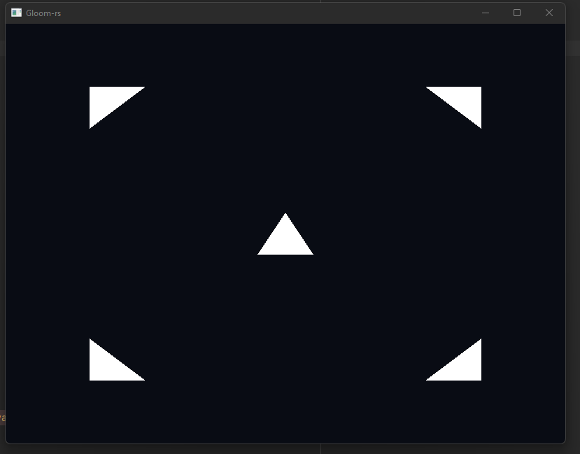
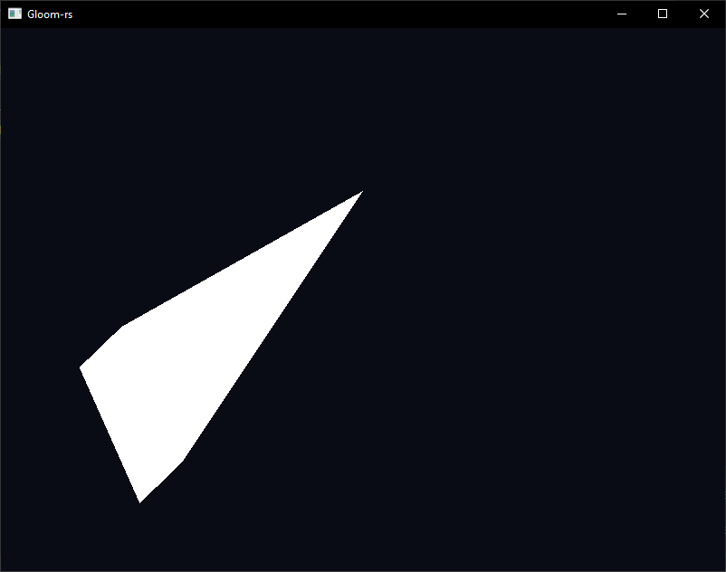
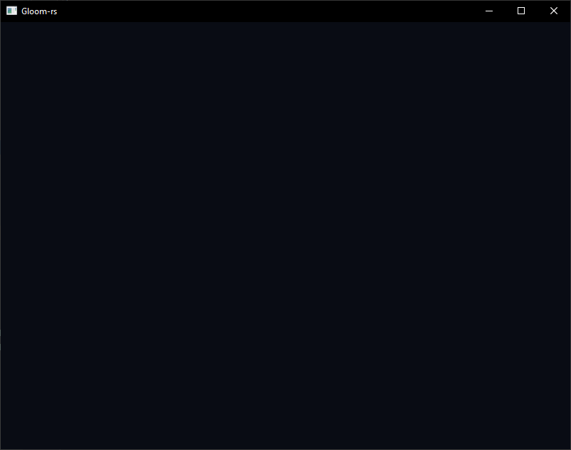
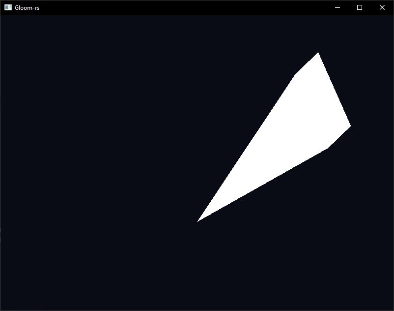
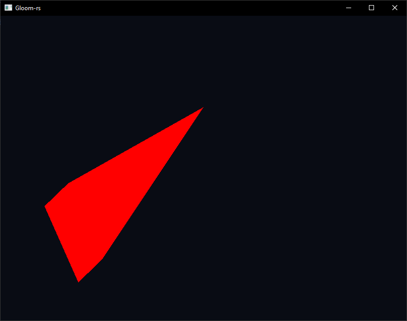

## TDT4195: Assignment 1 - Computer Graphics
* Nikola Dordevic
* Jørund Topp Løvlien

Task 1: Drawing your first triangle

c)
{height=3em}

Task 2: Geometry and Theory

a)


i) The phenomenom is called clipping.

ii) This phenomenom occurs when objects try to go out of bounds. 
Our system only goes up to 1.0 in each axis, so the z-axis faced towards us,
exceeds 1.0 it no longer gets rendered.

iii) To avoid unnecessary computations, which can be used elsewhere.

b)


i) When changing the indices from 0, 1, 2 to 0, 2, 1 the triangle is not showing.

ii) The front sides of a triangle are defined in a counter-clockwise manner, so when we list the indices out
of order, we are shows the backside of the triangle. To avoid unnecessary computations, 
the backsides of an of objects are culled, since we will never see them.

iii)
This effect occurs when the triangle is defined in a clockwise manner.

c)<br>
i) To match the current frame, the depth buffer is used to render the objects in the correct order.
If an object were to go in front of another in the next frame, and we use the last frame's depth buffer, 
the object in the back will appear in front of the other object, even when it shouldn't.

ii) In the situation where two objects are rasterized on top of each other, yet having different depth values.

iii) The two most common used type of shaders are fragment and vertex shaders.
Fragment shader has the responsibility to assign colour to each rasterized pixel input.
Vertex shaders has the responsibility to modify individual vertices, 
this allows us to move around models my applying transformations on each vertex.

iv) The use of index buffer is common because vertices are often reused. 
By reusing the same vertices for multiple triangles and specifying them in the index buffer, we save up a lot of memory.

v) It is used as an offset to account for several entry types in the bound vertex buffer.

d)<br>
To flip the scene horizontally and vertically we apply the position to be negative of what it actually was in the vertex shader.
```GLSL
#version 450 core

in vec3 position;

void main()
{
    gl_Position = vec4(-position, 1.0f);
}
```
Result: 


In order to change the color we simply change the RGBA vector in the fragment shader.
```GLSL
#version 450 core

out vec4 color;

void main()
{
    color = vec4(1.0f, 0.0f, 0.0f, 1.0f);
}
```
Result: 