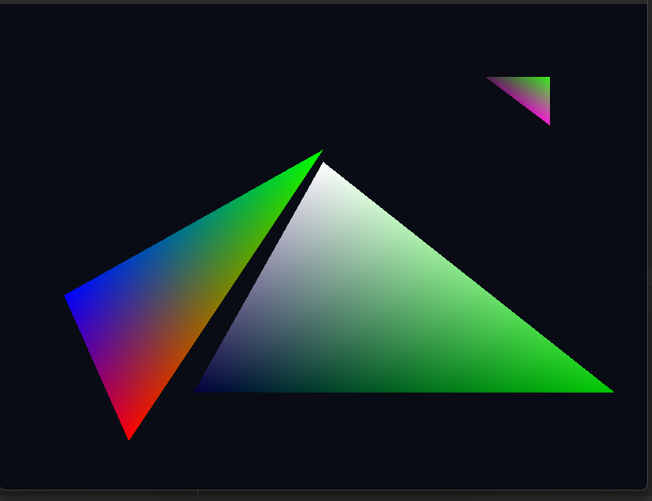
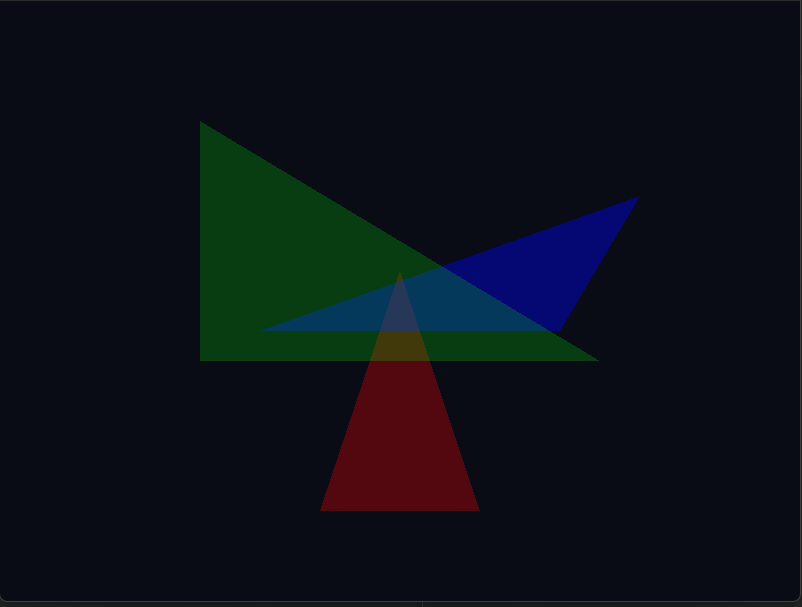

## TDT4195: Assignment 1 - Computer Graphics
* Nikola Dordevic
* Jørund Topp Løvlien

Task 1: Per-Vertex Colors  
b) 
{height=15em}
OpenGL applies a gradient in between the vertices as the color
transitions to the other specified in the corner.

Task 2: Alpha Blending and Depth  
a)  
{height=15em}

b)  
* i) Exchanging the colors between the triangles blended them accordingly.
    With some testing, we discovered that the order of the triangles played a factor in the color blending.
    It looks like the closest triangle affected the color the most. 
* ii) When swapping the depth certain triangles avoid alpha blending. 
  This is caused by the depth buffer when drawing a triangle 
  it checks if there are any triangles behind to alpha blend. 
  Since the given order is wrong there is only the background, which it applies the blending on, 
  afterwards it draws the next triangle which is behind the other one, and etc.

Task 3: The Affine Transformation Matrix  
b)  

> Modifying the value: **_a_** corresponds to the transformation: **_scaling_** in the **_x-axis_**  

> Modifying the value: **_b_** corresponds to the transformation: **_shear_** in the **_x-axis_**  

> Modifying the value: **_c_** corresponds to the transformation: **_2D homogeneous translation_** in the **_x-axis_**  

> Modifying the value: **_d_** corresponds to the transformation: **_shearing_** in the **_y-axis_**  

> Modifying the value: **_e_** corresponds to the transformation: **_scaling_** in the **_y-axis_**  

> Modifying the value: **_f_** corresponds to the transformation: **_2D homogeneous translation_** in the **_y-axis_**  

 
c)  
In order to achieve rotation transformation it would require the use of the values a,b,d,e.
As well as calculating the angles using trigonometric functions.

Task 4: Combinations of Transformations  
b) iv)  
We have used the following keybinds:  
> **_WASD_**, **_Space_** and **_LShift_** for **_movement_**  
> **_Arrow keys_** for **_rotation_**