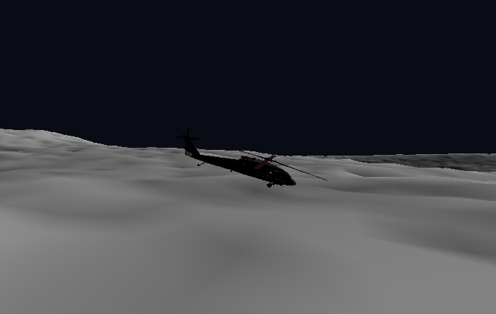
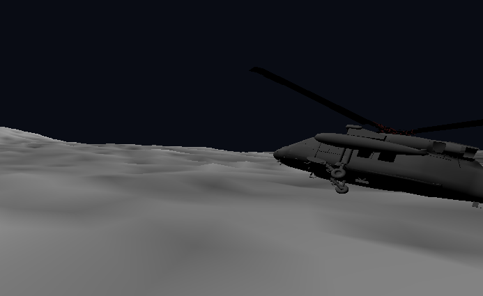
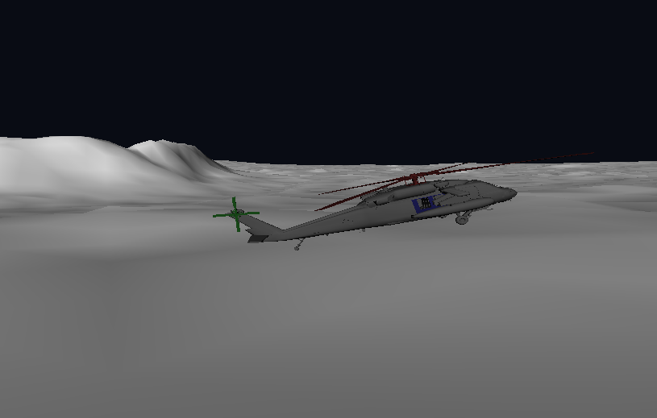
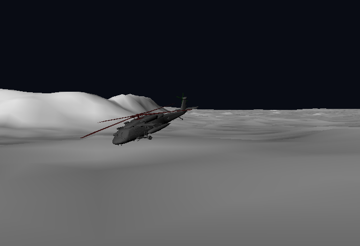
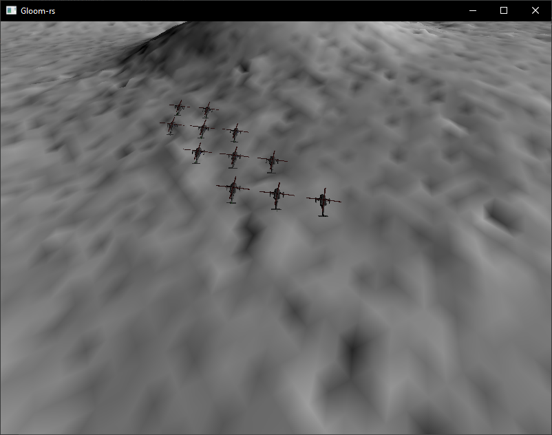

## TDT4195: Assignment 1 - Computer Graphics
* Nikola Dordevic
* Jørund Topp Løvlien

# Task 1:  More polygons than you can shake a stick at

c)  
{height=15em}
 
d)  
{height=15em}
 

## Task 2: Helicopter Parenting  

c)  
{height=15em}
 

## Task 5: Help! My lighting is wrong!  
a)  
{height=15em}
 
{height=15em}
 
 

c)  
{height=15em}
 
{height=15em}
 

## Task 6: Time to turn this thing up to 11 5  
a)  
{height=15em}

## Task 7: Optional Challenges  
d)  
Open and close the door with R and F