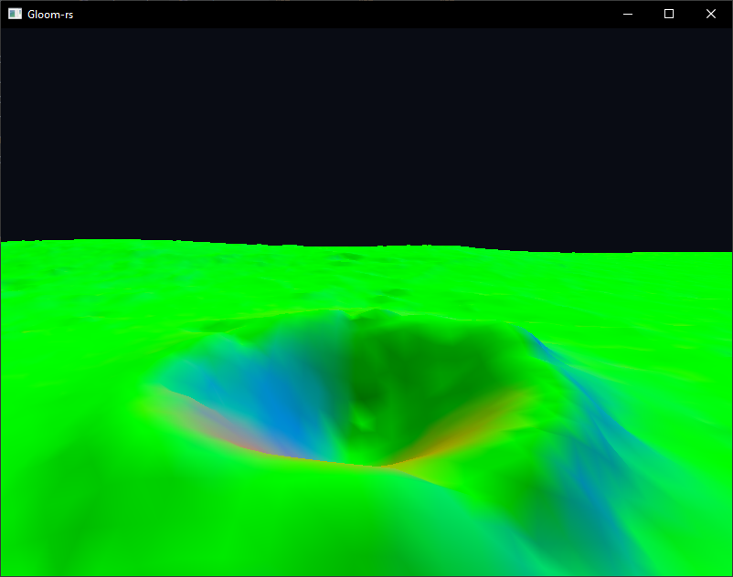
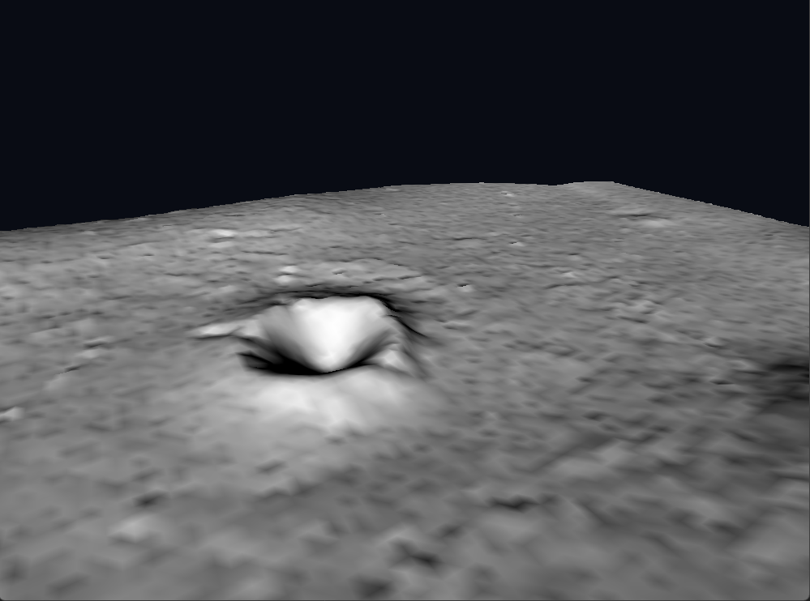
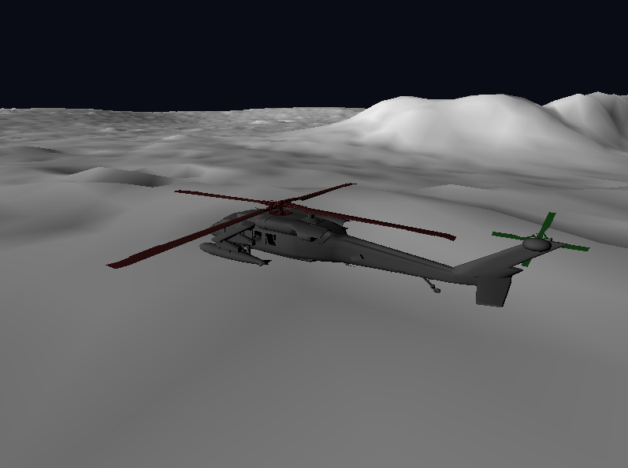

## TDT4195: Assignment 1 - Computer Graphics
* Nikola Dordevic
* Jørund Topp Løvlien

Task 1:  More polygons than you can shake a stick at

c)  
{height=15em}
 
d)  
{height=15em}
 

Task 2: Helicopter Parenting  

c)  
{height=15em}
 